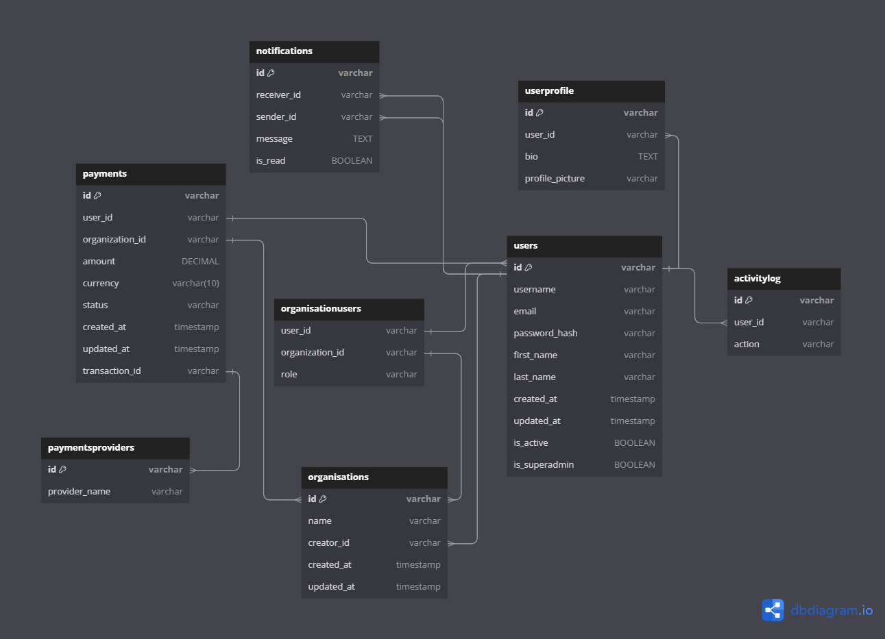

# FASTAPI

FastAPI boilerplate

## Setup

1. Create a virtual environment.

```sh
   python3 -m venv .venv
```

2. Activate virtual environment.

```sh
    source /path/to/venv/bin/activate`
```

3. Install project dependencies `pip install -r requirements.txt`
4. Create a .env file by copying the .env.sample file
   `cp .env.sample .env`

5. Start server.

```sh
python main.py
```

## Database Design



# Database Documentation

For more detailed information on the database schema and relationships, please refer to the [Database Documentation](https://dbdocs.io/Trevor%20job/hng_database_docs).

<h1 id="backend-benders-api">Backend-Benders API v1.0.0</h1>

This API serves as a foundational platform for web services, providing robust endpoints for essential functionalities such as authentication, user management, notifications, and payment processing.

### Api Specification [link](https://app.swaggerhub.com/apis-docs/ARMOLAS06/backend-benders_api/1.0.0#/)

<br />

Base URLs:

- <a href="http://localhost:3000/v1">http://localhost:3000/v1</a>

License: <a href="http://www.apache.org/licenses/LICENSE-2.0">Apache License</a>

# Authentication

- HTTP Authentication, scheme: bearer

<h1 id="backend-benders-api-users">Users</h1>

Users operations

## Get a single user

> Code samples

```shell
# You can also use wget
curl -X GET http://localhost:3000/v1/api/users/{userId} \
  -H 'Accept: application/json' \
  -H 'Authorization: Bearer {access-token}'

```

`GET /api/users/{userId}`

<h3 id="get-a-single-user-parameters">Parameters</h3>

| Name   | In   | Type    | Required | Description |
| ------ | ---- | ------- | -------- | ----------- |
| userId | path | integer | true     | none        |

<h3 id="get-a-single-user-responses">Responses</h3>

| Status | Meaning                                                        | Description         | Schema                      |
| ------ | -------------------------------------------------------------- | ------------------- | --------------------------- |
| 200    | [OK](https://tools.ietf.org/html/rfc7231#section-6.3.1)        | Successful response | [User](#schemauser)         |
| 404    | [Not Found](https://tools.ietf.org/html/rfc7231#section-6.5.4) | Resource not found  | [Error404](#schemaerror404) |

<aside class="warning">
To perform this operation, you must be authenticated by means of one of the following methods:
BearerAuth
</aside>

<br />
<h1 id="backend-benders-api-authentication">Authentication</h1>

Authentication operations

## Register a new user

> Code samples

```shell
# You can also use wget
curl -X POST http://localhost:3000/v1/auth/register \
  -H 'Content-Type: application/json' \
  -H 'Accept: application/json'

```

`POST /auth/register`

> Body parameter

```json
{
  "username": "string",
  "firstname": "string",
  "lastname": "string",
  "email": "user@example.com",
  "password": "pa$$word"
}
```

<h3 id="register-a-new-user-parameters">Parameters</h3>

| Name | In   | Type                                        | Required | Description |
| ---- | ---- | ------------------------------------------- | -------- | ----------- |
| body | body | [UserRegistration](#schemauserregistration) | true     | none        |

<h3 id="register-a-new-user-responses">Responses</h3>

| Status | Meaning                                                                  | Description                  | Schema                              |
| ------ | ------------------------------------------------------------------------ | ---------------------------- | ----------------------------------- |
| 201    | [Created](https://tools.ietf.org/html/rfc7231#section-6.3.2)             | User successfully registered | [AuthResponse](#schemaauthresponse) |
| 400    | [Bad Request](https://tools.ietf.org/html/rfc7231#section-6.5.1)         | Invalid input                | [Error400](#schemaerror400)         |
| 409    | [Conflict](https://tools.ietf.org/html/rfc7231#section-6.5.8)            | Resource already exists      | [Error](#schemaerror)               |
| 422    | [Unprocessable Entity](https://tools.ietf.org/html/rfc2518#section-10.3) | Validation error             | [Error](#schemaerror)               |

<aside class="success">
This operation does not require authentication
</aside>
<br />

## Log in a user

> Code samples

```shell
# You can also use wget
curl -X POST http://localhost:3000/v1/auth/login \
  -H 'Content-Type: application/json' \
  -H 'Accept: application/json'

```

`POST /auth/login`

> Body parameter

```json
{
  "email": "user@example.com",
  "password": "pa$$word"
}
```

<h3 id="log-in-a-user-parameters">Parameters</h3>

| Name | In   | Type                                        | Required | Description |
| ---- | ---- | ------------------------------------------- | -------- | ----------- |
| body | body | [LoginCredentials](#schemalogincredentials) | true     | none        |

<h3 id="log-in-a-user-responses">Responses</h3>

| Status | Meaning                                                                  | Description            | Schema                              |
| ------ | ------------------------------------------------------------------------ | ---------------------- | ----------------------------------- |
| 200    | [OK](https://tools.ietf.org/html/rfc7231#section-6.3.1)                  | Successfully logged in | [AuthResponse](#schemaauthresponse) |
| 401    | [Unauthorized](https://tools.ietf.org/html/rfc7235#section-3.1)          | Invalid credentials    | [Error](#schemaerror)               |
| 422    | [Unprocessable Entity](https://tools.ietf.org/html/rfc2518#section-10.3) | Invalid login input    | [Error](#schemaerror)               |

<aside class="success">
This operation does not require authentication
</aside>
<br />

## Request password reset

> Code samples

```shell
# You can also use wget
curl -X POST http://localhost:3000/v1/auth/reset-password \
  -H 'Content-Type: application/json' \
  -H 'Accept: application/json'

```

`POST /auth/reset-password`

> Body parameter

```json
{
  "email": "user@example.com"
}
```

<h3 id="request-password-reset-parameters">Parameters</h3>

| Name | In   | Type                                                | Required | Description |
| ---- | ---- | --------------------------------------------------- | -------- | ----------- |
| body | body | [PasswordResetRequest](#schemapasswordresetrequest) | true     | none        |

<h3 id="request-password-reset-responses">Responses</h3>

| Status | Meaning                                                                  | Description               | Schema                |
| ------ | ------------------------------------------------------------------------ | ------------------------- | --------------------- |
| 200    | [OK](https://tools.ietf.org/html/rfc7231#section-6.3.1)                  | Password reset email sent | None                  |
| 404    | [Not Found](https://tools.ietf.org/html/rfc7231#section-6.5.4)           | Email not found           | [Error](#schemaerror) |
| 422    | [Unprocessable Entity](https://tools.ietf.org/html/rfc2518#section-10.3) | Invalid email format      | [Error](#schemaerror) |

<aside class="success">
This operation does not require authentication
</aside>
<br />

## Change authenticated user's password

> Code samples

```shell
# You can also use wget
curl -X PUT http://localhost:3000/v1/auth/change-password \
  -H 'Content-Type: application/json' \
  -H 'Accept: application/json' \
  -H 'Authorization: Bearer {access-token}'

```

`PUT /auth/change-password`

> Body parameter

```json
{
  "current_password": "pa$$word",
  "new_password": "pa$$word"
}
```

<h3 id="change-authenticated-user's-password-parameters">Parameters</h3>

| Name | In   | Type                                                  | Required | Description |
| ---- | ---- | ----------------------------------------------------- | -------- | ----------- |
| body | body | [ChangePasswordRequest](#schemachangepasswordrequest) | true     | none        |

<h3 id="change-authenticated-user's-password-responses">Responses</h3>

| Status | Meaning                                                                  | Description                   | Schema                      |
| ------ | ------------------------------------------------------------------------ | ----------------------------- | --------------------------- |
| 200    | [OK](https://tools.ietf.org/html/rfc7231#section-6.3.1)                  | Password successfully changed | None                        |
| 400    | [Bad Request](https://tools.ietf.org/html/rfc7231#section-6.5.1)         | Invalid input                 | [Error400](#schemaerror400) |
| 401    | [Unauthorized](https://tools.ietf.org/html/rfc7235#section-3.1)          | Unauthorized                  | [Error401](#schemaerror401) |
| 422    | [Unprocessable Entity](https://tools.ietf.org/html/rfc2518#section-10.3) | Validation error              | [Error](#schemaerror)       |

<aside class="warning">
To perform this operation, you must be authenticated by means of one of the following methods:
BearerAuth
</aside>
<br />

## Log out the authenticated user

> Code samples

```shell
# You can also use wget
curl -X POST http://localhost:3000/v1/auth/logout \
  -H 'Accept: application/json' \
  -H 'Authorization: Bearer {access-token}'

```

`POST /auth/logout`

<h3 id="log-out-the-authenticated-user-responses">Responses</h3>

| Status | Meaning                                                         | Description             | Schema                      |
| ------ | --------------------------------------------------------------- | ----------------------- | --------------------------- |
| 200    | [OK](https://tools.ietf.org/html/rfc7231#section-6.3.1)         | Successfully logged out | None                        |
| 401    | [Unauthorized](https://tools.ietf.org/html/rfc7235#section-3.1) | Unauthorized            | [Error401](#schemaerror401) |

<aside class="warning">
To perform this operation, you must be authenticated by means of one of the following methods:
BearerAuth
</aside>
<br />

<h1 id="backend-benders-api-profile">Profile</h1>

Profile operations

## Get authenticated user's profile

> Code samples

```shell
# You can also use wget
curl -X GET http://localhost:3000/v1/api/profile \
  -H 'Accept: application/json' \
  -H 'Authorization: Bearer {access-token}'

```

`GET /api/profile`

<h3 id="get-authenticated-user's-profile-responses">Responses</h3>

| Status | Meaning                                                         | Description         | Schema                      |
| ------ | --------------------------------------------------------------- | ------------------- | --------------------------- |
| 200    | [OK](https://tools.ietf.org/html/rfc7231#section-6.3.1)         | Successful response | [User](#schemauser)         |
| 401    | [Unauthorized](https://tools.ietf.org/html/rfc7235#section-3.1) | Unauthorized        | [Error401](#schemaerror401) |

<aside class="warning">
To perform this operation, you must be authenticated by means of one of the following methods:
BearerAuth
</aside>
<br />

## Update authenticated user's profile

> Code samples

```shell
# You can also use wget
curl -X PUT http://localhost:3000/v1/api/profile \
  -H 'Content-Type: application/json' \
  -H 'Accept: application/json' \
  -H 'Authorization: Bearer {access-token}'

```

`PUT /api/profile`

> Body parameter

```json
{
  "username": "string",
  "email": "user@example.com"
}
```

<h3 id="update-authenticated-user's-profile-parameters">Parameters</h3>

| Name | In   | Type                            | Required | Description |
| ---- | ---- | ------------------------------- | -------- | ----------- |
| body | body | [UserUpdate](#schemauserupdate) | true     | none        |

<h3 id="update-authenticated-user's-profile-responses">Responses</h3>

| Status | Meaning                                                                  | Description                  | Schema                      |
| ------ | ------------------------------------------------------------------------ | ---------------------------- | --------------------------- |
| 200    | [OK](https://tools.ietf.org/html/rfc7231#section-6.3.1)                  | Profile successfully updated | [User](#schemauser)         |
| 400    | [Bad Request](https://tools.ietf.org/html/rfc7231#section-6.5.1)         | Invalid input                | [Error400](#schemaerror400) |
| 401    | [Unauthorized](https://tools.ietf.org/html/rfc7235#section-3.1)          | Unauthorized                 | [Error401](#schemaerror401) |
| 422    | [Unprocessable Entity](https://tools.ietf.org/html/rfc2518#section-10.3) | Validation error             | [Error](#schemaerror)       |

<aside class="warning">
To perform this operation, you must be authenticated by means of one of the following methods:
BearerAuth
</aside>
<br />

<h1 id="backend-benders-api-organisations">Organisations</h1>

Organisation operations

## Gets a list of all the organisations of the authenticated user

> Code samples

```shell
# You can also use wget
curl -X GET http://localhost:3000/v1/api/organisations \
  -H 'Accept: application/json' \
  -H 'Authorization: Bearer {access-token}'

```

`GET /api/organisations`

<h3 id="gets-a-list-of-all-the-organisations-of-the-authenticated-user-responses">Responses</h3>

| Status | Meaning                                                         | Description                        | Schema |
| ------ | --------------------------------------------------------------- | ---------------------------------- | ------ |
| 200    | [OK](https://tools.ietf.org/html/rfc7231#section-6.3.1)         | A JSON array of user organisations | Inline |
| 401    | [Unauthorized](https://tools.ietf.org/html/rfc7235#section-3.1) | User not authenticated             | Inline |

<aside class="warning">
To perform this operation, you must be authenticated by means of one of the following methods:
BearerAuth
</aside>
<br />

## Creates a organisation

> Code samples

```shell
# You can also use wget
curl -X POST http://localhost:3000/v1/api/organisations \
  -H 'Content-Type: application/json' \
  -H 'Accept: application/json' \
  -H 'Authorization: Bearer {access-token}'

```

`POST /api/organisations`

This endpoint creates a new organisation for the authenticated user

> Body parameter

```json
{
  "name": "string",
  "description": "string"
}
```

<h3 id="creates-a-organisation-parameters">Parameters</h3>

| Name          | In   | Type   | Required | Description                                                   |
| ------------- | ---- | ------ | -------- | ------------------------------------------------------------- |
| body          | body | object | true     | A dictionary of the details of the organisation to be created |
| » name        | body | string | false    | The name of the organisation to be created                    |
| » description | body | string | false    | A description of the organisation to be created               |

<h3 id="creates-a-organisation-responses">Responses</h3>

| Status | Meaning                                                          | Description                       | Schema |
| ------ | ---------------------------------------------------------------- | --------------------------------- | ------ |
| 201    | [Created](https://tools.ietf.org/html/rfc7231#section-6.3.2)     | Organisation created Successfully | Inline |
| 400    | [Bad Request](https://tools.ietf.org/html/rfc7231#section-6.5.1) | Invalid syntax                    | Inline |
| 401    | [Unauthorized](https://tools.ietf.org/html/rfc7235#section-3.1)  | User not authenticated            | Inline |

<aside class="warning">
To perform this operation, you must be authenticated by means of one of the following methods:
BearerAuth
</aside>
<br />

## Gets a single organisation

> Code samples

```shell
# You can also use wget
curl -X GET http://localhost:3000/v1/api/organisations/{orgId} \
  -H 'Accept: application/json' \
  -H 'Authorization: Bearer {access-token}'

```

`GET /api/organisations/{orgId}`

returns a single organisation from the organisations of the authenticated user

<h3 id="gets-a-single-organisation-parameters">Parameters</h3>

| Name  | In   | Type   | Required | Description                       |
| ----- | ---- | ------ | -------- | --------------------------------- |
| orgId | path | string | true     | The ID of the organisation to get |

<h3 id="gets-a-single-organisation-responses">Responses</h3>

| Status | Meaning                                                         | Description                         | Schema |
| ------ | --------------------------------------------------------------- | ----------------------------------- | ------ |
| 200    | [OK](https://tools.ietf.org/html/rfc7231#section-6.3.1)         | Organisation retrieved Successfully | Inline |
| 401    | [Unauthorized](https://tools.ietf.org/html/rfc7235#section-3.1) | User not authenticated              | Inline |
| 404    | [Not Found](https://tools.ietf.org/html/rfc7231#section-6.5.4)  | Organisation not found              | Inline |

<aside class="warning">
To perform this operation, you must be authenticated by means of one of the following methods:
BearerAuth
</aside>
<br />

## Adds a user to the organisation

> Code samples

```shell
# You can also use wget
curl -X POST http://localhost:3000/v1/api/organisations/{orgId} \
  -H 'Content-Type: application/json' \
  -H 'Accept: application/json' \
  -H 'Authorization: Bearer {access-token}'

```

`POST /api/organisations/{orgId}`

> Body parameter

```json
{
  "userId": "string"
}
```

<h3 id="adds-a-user-to-the-organisation-parameters">Parameters</h3>

| Name     | In   | Type   | Required | Description                                         |
| -------- | ---- | ------ | -------- | --------------------------------------------------- |
| orgId    | path | string | true     | The id of the organisation to add user              |
| body     | body | object | true     | The details of the user to be added to organisation |
| » userId | body | string | false    | The id of the user to be added                      |

<h3 id="adds-a-user-to-the-organisation-responses">Responses</h3>

| Status | Meaning                                                          | Description                             | Schema |
| ------ | ---------------------------------------------------------------- | --------------------------------------- | ------ |
| 200    | [OK](https://tools.ietf.org/html/rfc7231#section-6.3.1)          | User added to organisation successfully | Inline |
| 400    | [Bad Request](https://tools.ietf.org/html/rfc7231#section-6.5.1) | Invalid syntax                          | Inline |
| 401    | [Unauthorized](https://tools.ietf.org/html/rfc7235#section-3.1)  | unauthorized request                    | Inline |
| 404    | [Not Found](https://tools.ietf.org/html/rfc7231#section-6.5.4)   | User or Organisation not found          | Inline |

<aside class="warning">
To perform this operation, you must be authenticated by means of one of the following methods:
BearerAuth
</aside>
<br />

## deletes an organisation

> Code samples

```shell
# You can also use wget
curl -X DELETE http://localhost:3000/v1/api/organisations/{orgId} \
  -H 'Accept: application/json' \
  -H 'Authorization: Bearer {access-token}'

```

`DELETE /api/organisations/{orgId}`

Deletes an organisation created by the authenticated user

<h3 id="deletes-an-organisation-parameters">Parameters</h3>

| Name  | In   | Type   | Required | Description                            |
| ----- | ---- | ------ | -------- | -------------------------------------- |
| orgId | path | string | true     | The id of the organisation to add user |

<h3 id="deletes-an-organisation-responses">Responses</h3>

| Status | Meaning                                                         | Description                       | Schema |
| ------ | --------------------------------------------------------------- | --------------------------------- | ------ |
| 200    | [OK](https://tools.ietf.org/html/rfc7231#section-6.3.1)         | Organisation deleted successfully | Inline |
| 401    | [Unauthorized](https://tools.ietf.org/html/rfc7235#section-3.1) | unauthorized request              | Inline |
| 404    | [Not Found](https://tools.ietf.org/html/rfc7231#section-6.5.4)  | Organisation not found            | Inline |

<aside class="warning">
To perform this operation, you must be authenticated by means of one of the following methods:
BearerAuth
</aside>
<br />

## returns a list of all users in the organisation

> Code samples

```shell
# You can also use wget
curl -X GET http://localhost:3000/v1/api/organisations/{orgId}/users \
  -H 'Accept: application/json' \
  -H 'Authorization: Bearer {access-token}'

```

`GET /api/organisations/{orgId}/users`

A JSON array of all user objects in the organisation

<h3 id="returns-a-list-of-all-users-in-the-organisation-parameters">Parameters</h3>

| Name  | In   | Type   | Required | Description                            |
| ----- | ---- | ------ | -------- | -------------------------------------- |
| orgId | path | string | true     | The id of the organisation to add user |

<h3 id="returns-a-list-of-all-users-in-the-organisation-responses">Responses</h3>

| Status | Meaning                                                         | Description                                   | Schema |
| ------ | --------------------------------------------------------------- | --------------------------------------------- | ------ |
| 200    | [OK](https://tools.ietf.org/html/rfc7231#section-6.3.1)         | A JSON array of all users in the organisation | Inline |
| 401    | [Unauthorized](https://tools.ietf.org/html/rfc7235#section-3.1) | User not authenticated                        | Inline |
| 404    | [Not Found](https://tools.ietf.org/html/rfc7231#section-6.5.4)  | Organisation not found                        | Inline |

<aside class="warning">
To perform this operation, you must be authenticated by means of one of the following methods:
BearerAuth
</aside>
<br />

<h1 id="backend-benders-api-payments">Payments</h1>

Payments operations

## Gets all payments made by user

> Code samples

```shell
# You can also use wget
curl -X GET http://localhost:3000/v1/api/payments \
  -H 'Accept: application/json' \
  -H 'Authorization: Bearer {access-token}'

```

`GET /api/payments`

<h3 id="gets-all-payments-made-by-user-responses">Responses</h3>

| Status | Meaning                                                         | Description                | Schema                      |
| ------ | --------------------------------------------------------------- | -------------------------- | --------------------------- |
| 200    | [OK](https://tools.ietf.org/html/rfc7231#section-6.3.1)         | All payments were returned | Inline                      |
| 401    | [Unauthorized](https://tools.ietf.org/html/rfc7235#section-3.1) | Unauthorized               | [Error401](#schemaerror401) |

<aside class="warning">
To perform this operation, you must be authenticated by means of one of the following methods:
BearerAuth
</aside>
<br />

## Creates a payment record

> Code samples

```shell
# You can also use wget
curl -X POST http://localhost:3000/v1/api/payments \
  -H 'Content-Type: application/json' \
  -H 'Accept: application/json' \
  -H 'Authorization: Bearer {access-token}'

```

`POST /api/payments`

> Body parameter

```json
{
  "amount": 0,
  "currency": "string",
  "status": "string",
  "createdAt": "string"
}
```

<h3 id="creates-a-payment-record-parameters">Parameters</h3>

| Name | In   | Type                              | Required | Description |
| ---- | ---- | --------------------------------- | -------- | ----------- |
| body | body | [PaymentPost](#schemapaymentpost) | true     | none        |

<h3 id="creates-a-payment-record-responses">Responses</h3>

| Status | Meaning                                                          | Description                         | Schema                      |
| ------ | ---------------------------------------------------------------- | ----------------------------------- | --------------------------- |
| 201    | [Created](https://tools.ietf.org/html/rfc7231#section-6.3.2)     | Payment record created successfully | [Payment](#schemapayment)   |
| 400    | [Bad Request](https://tools.ietf.org/html/rfc7231#section-6.5.1) | Invalid input                       | [Error400](#schemaerror400) |
| 401    | [Unauthorized](https://tools.ietf.org/html/rfc7235#section-3.1)  | Unauthorized                        | [Error401](#schemaerror401) |

<aside class="warning">
To perform this operation, you must be authenticated by means of one of the following methods:
BearerAuth
</aside>
<br />

## Gets a Single Payment

> Code samples

```shell
# You can also use wget
curl -X GET http://localhost:3000/v1/api/payments/{payment_id} \
  -H 'Accept: application/json' \
  -H 'Authorization: Bearer {access-token}'

```

`GET /api/payments/{payment_id}`

<h3 id="gets-a-single-payment-parameters">Parameters</h3>

| Name       | In   | Type                          | Required | Description                               |
| ---------- | ---- | ----------------------------- | -------- | ----------------------------------------- |
| payment_id | path | [PaymentId](#schemapaymentid) | true     | The unique identifier of a payment record |

<h3 id="gets-a-single-payment-responses">Responses</h3>

| Status | Meaning                                                         | Description                        | Schema                      |
| ------ | --------------------------------------------------------------- | ---------------------------------- | --------------------------- |
| 200    | [OK](https://tools.ietf.org/html/rfc7231#section-6.3.1)         | Single payment object was returned | [Payment](#schemapayment)   |
| 401    | [Unauthorized](https://tools.ietf.org/html/rfc7235#section-3.1) | Unauthorized                       | [Error401](#schemaerror401) |
| 404    | [Not Found](https://tools.ietf.org/html/rfc7231#section-6.5.4)  | Resource not found                 | [Error404](#schemaerror404) |

<aside class="warning">
To perform this operation, you must be authenticated by means of one of the following methods:
BearerAuth
</aside>
<br />

## Delete a payment record

> Code samples

```shell
# You can also use wget
curl -X DELETE http://localhost:3000/v1/api/payments/{payment_id} \
  -H 'Accept: application/json' \
  -H 'Authorization: Bearer {access-token}'

```

`DELETE /api/payments/{payment_id}`

<h3 id="delete-a-payment-record-parameters">Parameters</h3>

| Name       | In   | Type                          | Required | Description                               |
| ---------- | ---- | ----------------------------- | -------- | ----------------------------------------- |
| payment_id | path | [PaymentId](#schemapaymentid) | true     | The unique identifier of a payment record |

<h3 id="delete-a-payment-record-responses">Responses</h3>

| Status | Meaning                                                         | Description                         | Schema                      |
| ------ | --------------------------------------------------------------- | ----------------------------------- | --------------------------- |
| 204    | [No Content](https://tools.ietf.org/html/rfc7231#section-6.3.5) | Payment record deleted successfully | None                        |
| 401    | [Unauthorized](https://tools.ietf.org/html/rfc7235#section-3.1) | Unauthorized                        | [Error401](#schemaerror401) |
| 404    | [Not Found](https://tools.ietf.org/html/rfc7231#section-6.5.4)  | Resource not found                  | [Error404](#schemaerror404) |

<aside class="warning">
To perform this operation, you must be authenticated by means of one of the following methods:
BearerAuth
</aside>
<br />

## Gets all payment providers available

> Code samples

```shell
# You can also use wget
curl -X GET http://localhost:3000/v1/api/payments-providers \
  -H 'Accept: application/json'

```

`GET /api/payments-providers`

<h3 id="gets-all-payment-providers-available-responses">Responses</h3>

| Status | Meaning                                                 | Description                 | Schema |
| ------ | ------------------------------------------------------- | --------------------------- | ------ |
| 200    | [OK](https://tools.ietf.org/html/rfc7231#section-6.3.1) | All providers were returned | Inline |

<h3 id="gets-all-payment-providers-available-responseschema">Response Schema</h3>

Status Code **200**

| Name            | Type                          | Required | Restrictions | Description |
| --------------- | ----------------------------- | -------- | ------------ | ----------- |
| _anonymous_     | [[Provider](#schemaprovider)] | false    | none         | none        |
| » provider_id   | string                        | true     | none         | none        |
| » provider_name | string                        | true     | none         | none        |

<aside class="success">
This operation does not require authentication
</aside>
<br />

## Gets a single payment provider

> Code samples

```shell
# You can also use wget
curl -X GET http://localhost:3000/v1/api/payments-providers/{provider_id} \
  -H 'Accept: application/json'

```

`GET /api/payments-providers/{provider_id}`

<h3 id="gets-a-single-payment-provider-parameters">Parameters</h3>

| Name        | In   | Type   | Required | Description                                 |
| ----------- | ---- | ------ | -------- | ------------------------------------------- |
| provider_id | path | string | true     | The unique identifier of a payment provider |

<h3 id="gets-a-single-payment-provider-responses">Responses</h3>

| Status | Meaning                                                        | Description                         | Schema                      |
| ------ | -------------------------------------------------------------- | ----------------------------------- | --------------------------- |
| 200    | [OK](https://tools.ietf.org/html/rfc7231#section-6.3.1)        | Single provider object was returned | [Provider](#schemaprovider) |
| 404    | [Not Found](https://tools.ietf.org/html/rfc7231#section-6.5.4) | Resource not found                  | [Error404](#schemaerror404) |

<aside class="success">
This operation does not require authentication
</aside>
<br />

<h1 id="backend-benders-api-notifications">Notifications</h1>

Notification operations

## Gets all notifications for the authenticated user

> Code samples

```shell
# You can also use wget
curl -X GET http://localhost:3000/v1/api/notifications \
  -H 'Accept: application/json' \
  -H 'Authorization: Bearer {access-token}'

```

`GET /api/notifications`

<h3 id="gets-all-notifications-for-the-authenticated-user-responses">Responses</h3>

| Status | Meaning                                                 | Description                     | Schema |
| ------ | ------------------------------------------------------- | ------------------------------- | ------ |
| 200    | [OK](https://tools.ietf.org/html/rfc7231#section-6.3.1) | All notifications were returned | Inline |

<aside class="warning">
To perform this operation, you must be authenticated by means of one of the following methods:
BearerAuth
</aside>
<br />

## Creates a new notification

> Code samples

```shell
# You can also use wget
curl -X POST http://localhost:3000/v1/api/notifications \
  -H 'Content-Type: application/json' \
  -H 'Accept: application/json'

```

`POST /api/notifications`

> Body parameter

```json
{
  "id": "string",
  "message": "string",
  "createdAt": "string"
}
```

<h3 id="creates-a-new-notification-parameters">Parameters</h3>

| Name | In   | Type                                | Required | Description |
| ---- | ---- | ----------------------------------- | -------- | ----------- |
| body | body | [Notification](#schemanotification) | true     | none        |

<h3 id="creates-a-new-notification-responses">Responses</h3>

| Status | Meaning                                                          | Description                       | Schema                              |
| ------ | ---------------------------------------------------------------- | --------------------------------- | ----------------------------------- |
| 201    | [Created](https://tools.ietf.org/html/rfc7231#section-6.3.2)     | Notification created successfully | [Notification](#schemanotification) |
| 400    | [Bad Request](https://tools.ietf.org/html/rfc7231#section-6.5.1) | Invalid input                     | [Error400](#schemaerror400)         |
| 401    | [Unauthorized](https://tools.ietf.org/html/rfc7235#section-3.1)  | Unauthorized                      | [Error401](#schemaerror401)         |

<aside class="success">
This operation does not require authentication
</aside>
<br />

## Retrive a specific notification

> Code samples

```shell
# You can also use wget
curl -X GET http://localhost:3000/v1/api/notifications/{notification_id} \
  -H 'Accept: application/json'

```

`GET /api/notifications/{notification_id}`

<h3 id="retrive-a-specific-notification-parameters">Parameters</h3>

| Name            | In   | Type   | Required | Description |
| --------------- | ---- | ------ | -------- | ----------- |
| notification_id | path | string | true     | none        |

<h3 id="retrive-a-specific-notification-responses">Responses</h3>

| Status | Meaning                                                        | Description                         | Schema                              |
| ------ | -------------------------------------------------------------- | ----------------------------------- | ----------------------------------- |
| 200    | [OK](https://tools.ietf.org/html/rfc7231#section-6.3.1)        | Notification retrieved successfully | [Notification](#schemanotification) |
| 404    | [Not Found](https://tools.ietf.org/html/rfc7231#section-6.5.4) | Resource not found                  | [Error404](#schemaerror404)         |

<aside class="success">
This operation does not require authentication
</aside>
<br />

## Delete a notification

> Code samples

```shell
# You can also use wget
curl -X DELETE http://localhost:3000/v1/api/notifications/{notification_id} \
  -H 'Accept: application/json'

```

`DELETE /api/notifications/{notification_id}`

<h3 id="delete-a-notification-parameters">Parameters</h3>

| Name            | In   | Type   | Required | Description |
| --------------- | ---- | ------ | -------- | ----------- |
| notification_id | path | string | true     | none        |

<h3 id="delete-a-notification-responses">Responses</h3>

| Status | Meaning                                                         | Description                       | Schema                      |
| ------ | --------------------------------------------------------------- | --------------------------------- | --------------------------- |
| 204    | [No Content](https://tools.ietf.org/html/rfc7231#section-6.3.5) | Notification deleted successfully | None                        |
| 404    | [Not Found](https://tools.ietf.org/html/rfc7231#section-6.5.4)  | Resource not found                | [Error404](#schemaerror404) |

<aside class="success">
This operation does not require authentication
</aside>
<br />

<h1 id="backend-benders-api-activity">Activity</h1>

Activity log operations

## Gets all activity logs for the authenticated user

> Code samples

```shell
# You can also use wget
curl -X GET http://localhost:3000/v1/api/activity-log \
  -H 'Accept: application/json' \
  -H 'Authorization: Bearer {access-token}'

```

`GET /api/activity-log`

<h3 id="gets-all-activity-logs-for-the-authenticated-user-responses">Responses</h3>

| Status | Meaning                                                 | Description                     | Schema |
| ------ | ------------------------------------------------------- | ------------------------------- | ------ |
| 200    | [OK](https://tools.ietf.org/html/rfc7231#section-6.3.1) | All activity logs were returned | Inline |

<aside class="warning">
To perform this operation, you must be authenticated by means of one of the following methods:
BearerAuth
</aside>
<br />

## Creates a new activity log

> Code samples

```shell
# You can also use wget
curl -X POST http://localhost:3000/v1/api/activity-log \
  -H 'Content-Type: application/json' \
  -H 'Accept: application/json'

```

`POST /api/activity-log`

> Body parameter

```json
{
  "id": "string",
  "action": "string",
  "createdAt": "string"
}
```

<h3 id="creates-a-new-activity-log-parameters">Parameters</h3>

| Name | In   | Type                              | Required | Description |
| ---- | ---- | --------------------------------- | -------- | ----------- |
| body | body | [ActivityLog](#schemaactivitylog) | true     | none        |

<h3 id="creates-a-new-activity-log-responses">Responses</h3>

| Status | Meaning                                                          | Description                       | Schema                            |
| ------ | ---------------------------------------------------------------- | --------------------------------- | --------------------------------- |
| 201    | [Created](https://tools.ietf.org/html/rfc7231#section-6.3.2)     | Activity log created successfully | [ActivityLog](#schemaactivitylog) |
| 400    | [Bad Request](https://tools.ietf.org/html/rfc7231#section-6.5.1) | Invalid input                     | [Error400](#schemaerror400)       |
| 401    | [Unauthorized](https://tools.ietf.org/html/rfc7235#section-3.1)  | Unauthorized                      | [Error401](#schemaerror401)       |

<aside class="success">
This operation does not require authentication
</aside>
<br />

# Authors

- Ukeme Edet - https://github.com/Nifilat
- Oluwanifemi Latunde - https://github.com/Nifilat
- Trevor Job - https://github.com/Nifilat
- Murithador Arowolo - https://github.com/Arnthorny
- Anthony Ebo - https://github.com/Arnthorny
